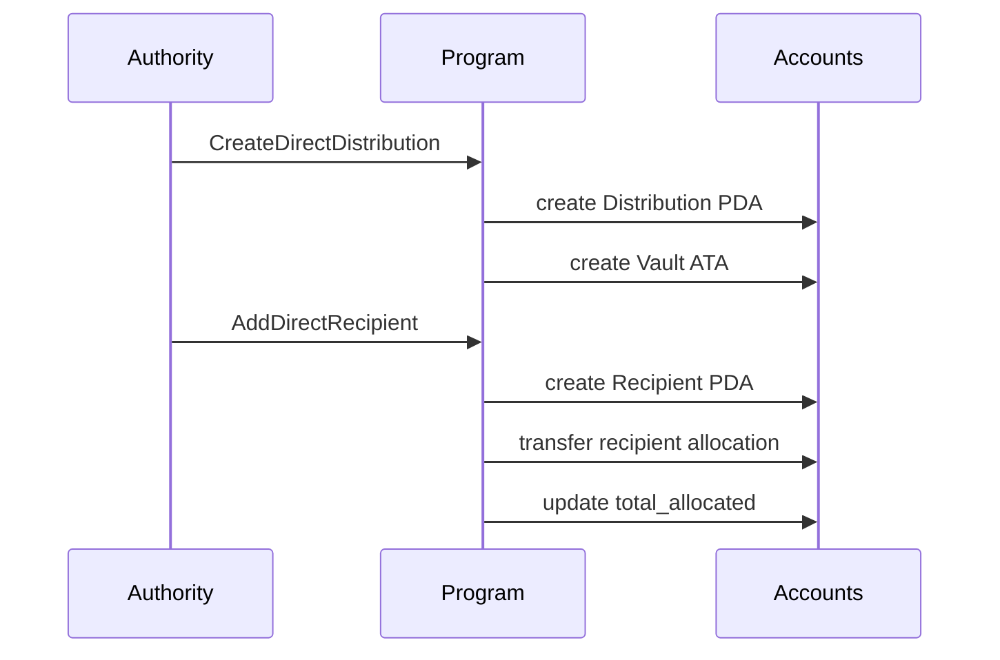
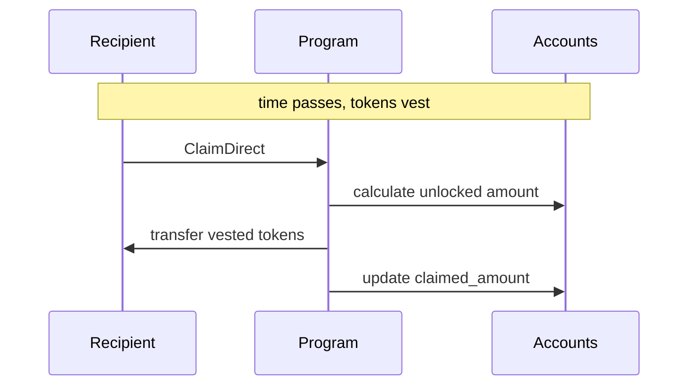
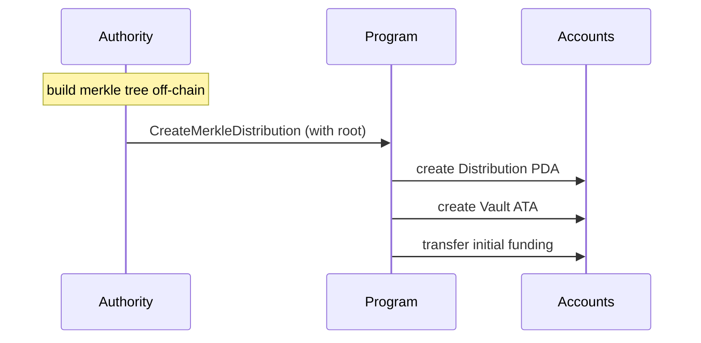
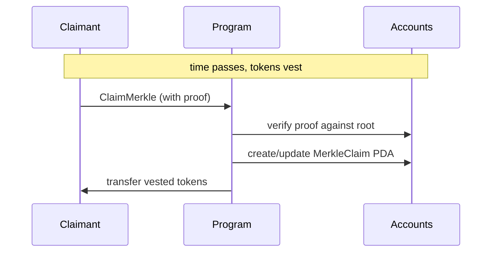
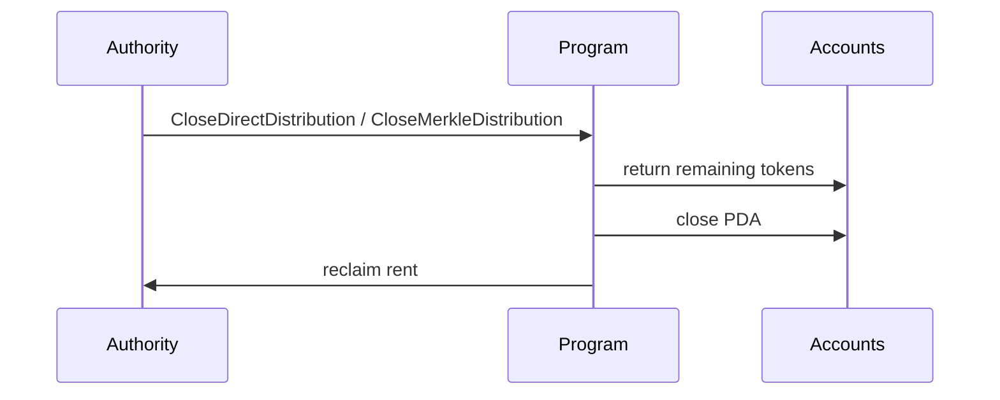

# Rewards Program

[](LICENSE)
[](https://github.com/anza-xyz/pinocchio)
[](https://solana.com)

## Program ID

```
REWArDioXgQJ2fZKkfu9LCLjQfRwYWVVfsvcsR5hoXi
```

## Deployments

| Network | Program ID |
| ------- | ---------- |

## Overview

A token rewards program for Solana that supports two distribution models: direct allocations with vesting and merkle-proof-based claims.

## Key Features

- **Two distribution types** - Direct (on-chain recipient accounts) and Merkle (off-chain tree, on-chain root)
- **Configurable vesting schedules** - Immediate, Linear, Cliff, and CliffLinear (Direct and Merkle)
- **Revocation support** - Authority can revoke recipients in Direct and Merkle distributions (NonVested or Full mode)
- **Token-2022 support** - Works with both SPL Token and Token-2022 mints

## When to Use What

### Distribution Type

|                  | Direct                                          | Merkle                                                                   |
| ---------------- | ----------------------------------------------- | ------------------------------------------------------------------------ |
| **How it works** | Creates an on-chain account per recipient       | Stores a single merkle root on-chain; recipients provide proofs to claim |
| **Upfront cost** | Payer funds rent for every recipient account    | No per-recipient accounts until someone claims                           |
| **Scalability**  | Practical up to low thousands of recipients     | Scales to millions with constant on-chain storage                        |
| **Mutability**   | Recipients can be added after creation          | Recipient set is fixed at creation                                       |
| **Best for**     | Small, dynamic distributions                    | Large, fixed distributions                                               |

### Vesting Schedule (Direct & Merkle only)

| Schedule        | Behavior                                                                                                                                          |
| --------------- | ------------------------------------------------------------------------------------------------------------------------------------------------- |
| **Immediate**   | All tokens are claimable right away                                                                                                               |
| **Linear**      | Tokens unlock proportionally between `start_ts` and `end_ts`                                                                                      |
| **Cliff**       | Nothing unlocks until `cliff_ts`, then everything unlocks at once                                                                                 |
| **CliffLinear** | Nothing unlocks until `cliff_ts`, then linear vesting from `start_ts` to `end_ts` (tokens accrued before the cliff become claimable at the cliff) |

### Revocation Modes

| Mode          | Behavior                                                                     |
| ------------- | ---------------------------------------------------------------------------- |
| **NonVested** | Vested/accrued tokens are transferred to the user; unvested tokens are freed |
| **Full**      | All unclaimed tokens (vested and unvested) are returned to the authority     |

Revocation is opt-in per distribution via the `revocable` bitmask field. A `Revocation` marker PDA is created per user to permanently block future claims.

## Account Types

| Account            | PDA Seeds                                                     | Description                                   |
| ------------------ | ------------------------------------------------------------- | --------------------------------------------- |
| DirectDistribution | `["direct_distribution", mint, authority, seed]`              | Distribution config (authority, mint, totals) |
| DirectRecipient    | `["direct_recipient", distribution, recipient]`               | Recipient allocation and vesting schedule     |
| MerkleDistribution | `["merkle_distribution", mint, authority, seed]`              | Distribution config with merkle root          |
| MerkleClaim        | `["merkle_claim", distribution, claimant]`                    | Tracks claimed amount per claimant            |
| Revocation         | `["revocation", parent, user]`                                | Marker PDA blocking revoked users (all types) |

## Instructions

### Direct Distribution

| #   | Instruction              | Description                                         |
| --- | ------------------------ | --------------------------------------------------- |
| 0   | CreateDirectDistribution | Create distribution and vault                       |
| 1   | AddDirectRecipient       | Add recipient with vesting schedule                 |
| 2   | ClaimDirect              | Recipient claims vested tokens                      |
| 9   | RevokeDirectRecipient    | Authority revokes a recipient                       |
| 4   | CloseDirectRecipient     | Recipient reclaims rent after full vest             |
| 3   | CloseDirectDistribution  | Authority closes distribution, reclaims tokens/rent |

### Merkle Distribution

| #   | Instruction              | Description                                         |
| --- | ------------------------ | --------------------------------------------------- |
| 5   | CreateMerkleDistribution | Create distribution with merkle root, fund vault    |
| 6   | ClaimMerkle              | Claimant proves allocation and claims vested tokens |
| 10  | RevokeMerkleClaim        | Authority revokes a claimant with merkle proof      |
| 7   | CloseMerkleClaim         | Claimant reclaims rent after distribution closed    |
| 8   | CloseMerkleDistribution  | Authority closes distribution, reclaims tokens/rent |

## Workflow

### Direct Distribution


```mermaid
sequenceDiagram
    participant Authority
    participant Program
    participant Accounts

    Authority->>Program: CreateDirectDistribution
    Program->>Accounts: create Distribution PDA
    Program->>Accounts: create Vault ATA
    Authority->>Program: AddDirectRecipient
    Program->>Accounts: create Recipient PDA
    Program->>Accounts: transfer recipient allocation
    Program->>Accounts: update total_allocated
```


```mermaid
sequenceDiagram
    participant Recipient
    participant Program
    participant Accounts

    Note over Recipient,Accounts: time passes, tokens vest

    Recipient->>Program: ClaimDirect
    Program->>Accounts: calculate unlocked amount
    Program->>Recipient: transfer vested tokens
    Program->>Accounts: update claimed_amount
```

### Merkle Distribution


```mermaid
sequenceDiagram
    participant Authority
    participant Program
    participant Accounts

    Note over Authority: build merkle tree off-chain
    Authority->>Program: CreateMerkleDistribution (with root)
    Program->>Accounts: create Distribution PDA
    Program->>Accounts: create Vault ATA
    Program->>Accounts: transfer initial funding
```


```mermaid
sequenceDiagram
    participant Claimant
    participant Program
    participant Accounts

    Note over Claimant,Accounts: time passes, tokens vest

    Claimant->>Program: ClaimMerkle (with proof)
    Program->>Accounts: verify proof against root
    Program->>Accounts: create/update MerkleClaim PDA
    Program->>Claimant: transfer vested tokens
```

### Closing


```mermaid
sequenceDiagram
    participant Authority
    participant Program
    participant Accounts

    Authority->>Program: CloseDirectDistribution / CloseMerkleDistribution
    Program->>Accounts: return remaining tokens
    Program->>Accounts: close PDA
    Program->>Authority: reclaim rent
```

## Documentation

- [Direct Distribution](program/src/instructions/direct/README.md) - On-chain recipient accounts with vesting
- [Merkle Distribution](program/src/instructions/merkle/README.md) - Off-chain tree, on-chain root verification

## Local Development

### Prerequisites

- Rust
- Node.js (see `.nvmrc`)
- pnpm (see `package.json` `packageManager`)
- Solana CLI

All can be conveniently installed via the [Solana CLI Quick Install](https://solana.com/docs/intro/installation).

### Build & Test

```bash
# Install dependencies
just install

# Full build (IDL + clients + program)
just build

# Run integration tests
just integration-test

# Run integration tests and generate a compute unit report (cu_report.md)
just test-and-benchmark

# Format and lint
just fmt
```

## Tech Stack

- **[Pinocchio](https://github.com/anza-xyz/pinocchio)** - Lightweight `no_std` Solana framework
- **[Codama](https://github.com/codama-idl)** - IDL-driven client generation
- **[LiteSVM](https://github.com/LiteSVM/litesvm)** - Fast local testing

## Security Audit

`rewards` has been audited by [OtterSec](https://osec.io). View the [audit report](audits/2026-ottersec-solana-foundation-rewards-audit.pdf).

Audit status, audited-through commit, and the current unaudited delta are tracked in [audits/AUDIT_STATUS.md](audits/AUDIT_STATUS.md).

---

Built and maintained by the [Solana Foundation](https://solana.org/).

Licensed under MIT. See [LICENSE](LICENSE) for details.

## Support

- [**Solana StackExchange**](https://solana.stackexchange.com/) - tag `rewards-program`
- [**Open an Issue**](https://github.com/solana-foundation/rewards/issues/new)
